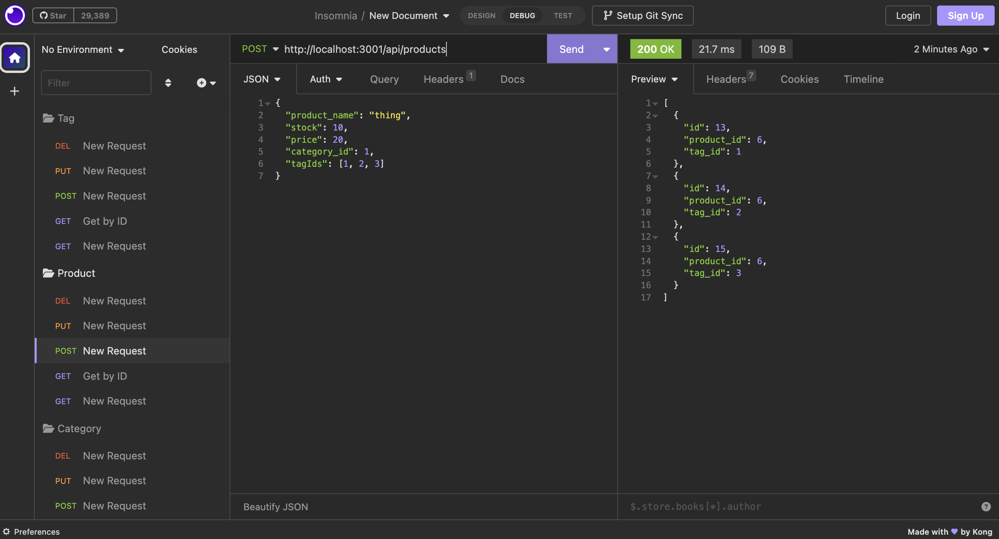

# e-commerce-site
A repository for an e-commerce site that uses an Express.js API with Sequelize to interact with a MySQL database. 

## Usage and Installation

Please utilize the command line on your machine to use this generator. This generator utilizes node.js, Sequelize, dotenv, and MySQL2. Please be sure that they are installed. Run node run start in the command line to initialize the application.

[Walkthrough Video](https://watch.screencastify.com/v/EJ1Hdlpxgq3Yy1KjKdSm)

Screenshot of application test example in Insomnia:

## Credits

I received starter code for this application from this [GitHub repository](https://github.com/coding-boot-camp/fantastic-umbrella.git). I also received support from a tutor to finish my apis and to run tests in Insomnia.  

## License

Please refer to the LICENSE in the repo.
